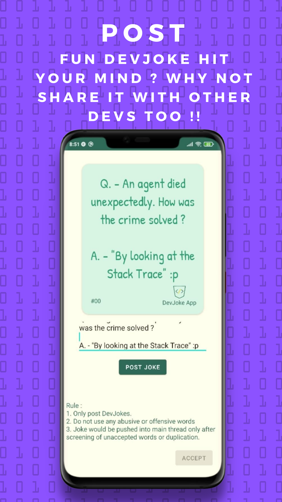
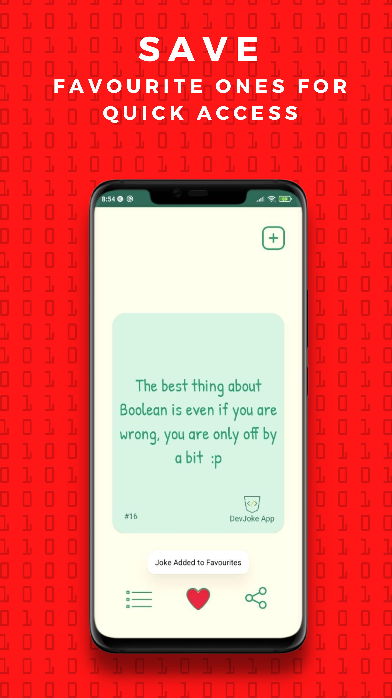
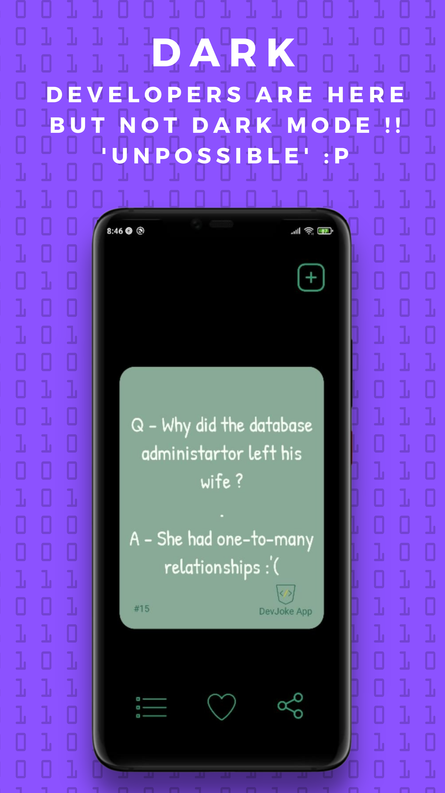

<h1 align="center">DevJoke App</h1>

<p align="center"> 
<a href="https://play.google.com/store/apps/details?id=com.shalatan.devjoke" target="_blank">  </a>
</p>

# Screenshots
<p align="center">



</p>
<p align="center">



</p>

# Tech stack & Open-source libraries
- Minimum SDK level 24
- Single activity Appication using [Navigation Component](https://developer.android.com/guide/navigation) to navigate between fragments
- 100% [Kotlin](https://kotlinlang.org/) based, [Coroutines](https://github.com/Kotlin/kotlinx.coroutines) + [LiveData](https://developer.android.com/topic/libraries/architecture/livedata)
- JetPack
  - LiveData - Notify Domain Layer data to views.
  - LifeCycle - dispose of observing data when lifecycle state changes.
  - ViewModel - UI related data holder, lifecycle aware.
  - Room Persistence - construct a database using the abstract layer.
- Architecture
  - MVVM Architecture (View - DataBinding - ViewModel - Model)
  - [Bindables](https://github.com/skydoves/bindables) - Android DataBinding kit for notifying data changes to UI layers.
- [Room](https://developer.android.com/training/data-storage/room) - To Save Data in Local Database
- [Material-Components](https://github.com/material-components/material-components-android) - Material design components like cardView, buttons etc.
- [Motion Layout](https://developer.android.com/training/constraint-layout/motionlayout) - To implement motions in fragments

# MAD Score


# Architecture
Movies Kex is based on MVVM architecture and repository pattern.


# License
```xml
Copyright 2021 Shashank Singh

Licensed under the Apache License, Version 2.0 (the "License");
you may not use this file except in compliance with the License.
You may obtain a copy of the License at

    http://www.apache.org/licenses/LICENSE-2.0

Unless required by applicable law or agreed to in writing, software
distributed under the License is distributed on an "AS IS" BASIS,
WITHOUT WARRANTIES OR CONDITIONS OF ANY KIND, either express or implied.
See the License for the specific language governing permissions and
limitations under the License.
```